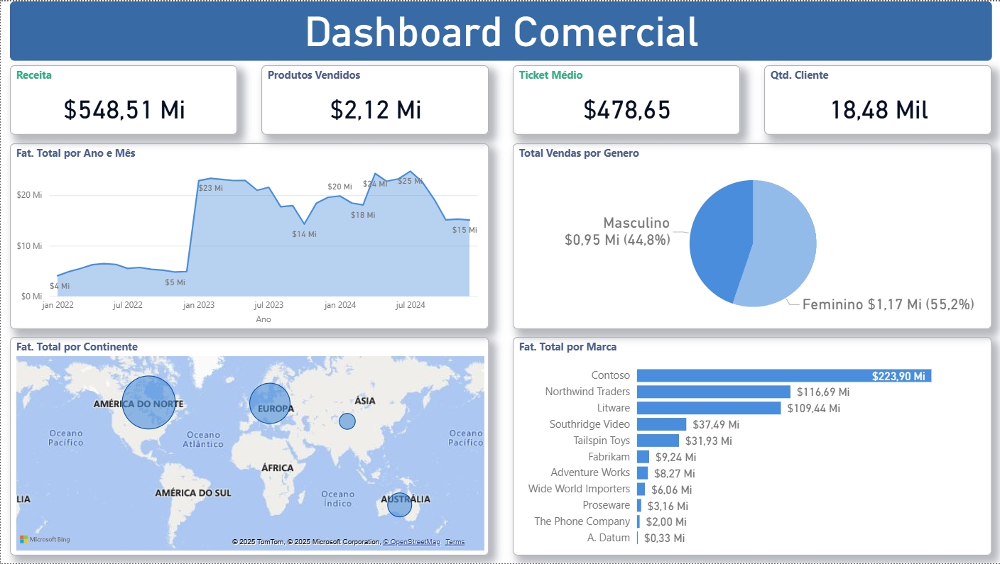

# Projeto: Dashboard Comercial Interativo (Power BI)

Este projeto é um dashboard de Business Intelligence completo, desenvolvido 100% no Microsoft Power BI, focado na análise de performance comercial e financeira.

## 📊 Visualização do Dashboard

## 1. Descrição

O objetivo deste projeto é criar uma ferramenta analítica robusta que transforma dados brutos de vendas em insights estratégicos, permitindo uma tomada de decisão ágil e baseada em dados (data-driven), simulando um ambiente corporativo real.

O desenvolvimento seguiu o ciclo completo de BI, desde a ingestão e tratamento dos dados até a disponibilização dos relatórios interativos.

## 2. Processo de Desenvolvimento

* **ETL (Extract, Transform, Load):** Os dados brutos (provenientes de arquivos Excel/CSV na pasta `/data/`) foram conectados ao Power BI. Utilizei o **Power Query** para realizar um processo de limpeza e transformação (data cleaning), tratando valores nulos, corrigindo tipos de dados e otimizando o modelo.
* **Modelagem de Dados:** Estruturei um **modelo de dados relacional (esquema estrela)**, conectando a tabela fato principal (fVendas) às tabelas dimensão (dCliente, dProduto, dCalendario) através de chaves, garantindo performance e clareza nas consultas.
* **Cálculos (DAX):** Desenvolvi diversas medidas em **DAX (Data Analysis Expressions)** para criar os KPIs (Indicadores-Chave de Desempenho) necessários, incluindo Receita Total, Ticket Médio, Qtd. de Clientes, Vendas por Gênero e Faturamento por Marca.

## 3. Funcionalidades e Insights

O dashboard final é totalmente interativo e permite ao usuário:

* **Visão Geral (KPIs):** Acesso rápido aos indicadores centrais (Receita Total: R$ 548,51 Mi; Clientes: 18,48 Mil; Ticket Médio: R$ 478,65).
* **Análise Temporal:** Acompanhar a evolução do faturamento ao longo dos anos e meses.
* **Análise Geográfica:** Identificar o faturamento por continente (com destaque para "AMÉRICA DO NORTE").
* **Ranking de Performance:** Classificar as marcas com maior receita (ex: "Contoso" com R$ 223,90 Mi).
* **Segmentação de Clientes:** Analisar a proporção de vendas por gênero (ex: "Feminino" com 55,2%).
* **Interatividade (Cross-Filtering):** Todos os visuais são conectados. Ao clicar em um segmento (ex: "Feminino" ou "Contoso"), todo o painel é filtrado automaticamente.

## 4. Ferramentas Utilizadas

* **Microsoft Power BI Desktop:** Plataforma principal para desenvolvimento, modelagem e visualização.
* **Power Query:** Ferramenta de ETL (para extração e transformação de dados).
* **DAX (Data Analysis Expressions):** Linguagem para criação das métricas e cálculos.
* **Excel/CSV:** Utilizados como fonte de dados (data source).
